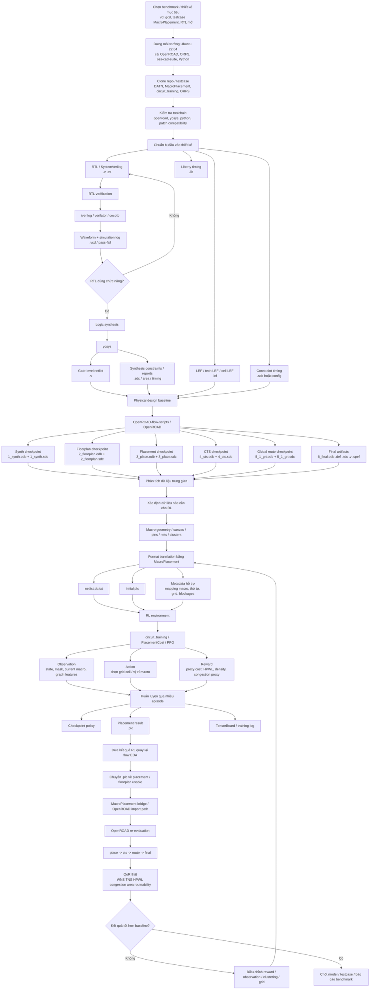

# Full Open-Source RTL-to-RL Macro Placement Guide

## Workflow đầy đủ toàn bộ quá trình

### Workflow rút gọn: tool, input, output, RL state-action-reward

```mermaid
flowchart LR
    A[RTL\n.v .sv] --> B[Verification\niverilog / verilator]
    B --> C[Synthesis\nyosys]
    C --> D[Gate netlist + constraints\n.v + .sdc]
    D --> E[Physical design\nOpenROAD / ORFS]
    E --> F[EDA checkpoints\n.odb .def .spef .v]
    F --> G[Format translation\nMacroPlacement]
    G --> H[RL inputs\nnetlist.pb.txt + initial.plc]
    H --> I[RL training\ncircuit_training / PPO]
    I --> J[RL output\n.plc]
    J --> K[Back to OpenROAD\nre-evaluate QoR]
    K --> L[Metrics\nHPWL congestion WNS TNS area]
```

| Bước | Phần mềm chính | Input | Output | Ghi chú |
|---|---|---|---|---|
| 1. Verify RTL | `iverilog`, `verilator` | `.v`, `.sv`, testbench | log, `.vcd` | kiểm tra chức năng |
| 2. Synthesis | `yosys` | RTL + `.lib` | gate netlist `.v`, `.sdc` | chuyển RTL sang netlist cell chuẩn |
| 3. Floorplan/Place/Route baseline | `OpenROAD`, `ORFS` | `.v`, `.sdc`, `.lef`, `.lib`, config | `.odb`, `.def`, `.spef`, final `.v` | tạo dữ liệu vật lý baseline |
| 4. Chuyển format cho RL | `MacroPlacement` | `.lef`, `.def`, netlist, metadata | `netlist.pb.txt`, `initial.plc` | biến dữ liệu EDA thành input RL |
| 5. Train RL | `circuit_training` | `netlist.pb.txt`, `initial.plc` | policy checkpoint, `.plc` | học cách đặt macro |
| 6. Đánh giá lại | `OpenROAD` | `.plc` + dữ liệu EDA | QoR sau place/cts/route | so với baseline không RL |

### RL nhìn bài toán như thế nào

| Thành phần | Ý nghĩa |
|---|---|
| `State / Observation` | thông tin netlist, macro hiện tại, vị trí macro đã đặt, occupancy grid, mask vị trí hợp lệ |
| `Action` | chọn một grid cell hoặc vị trí `(x, y)` hợp lệ cho macro hiện tại |
| `Reward` | thường là âm của proxy cost, ví dụ `-(HPWL + density penalty + congestion penalty)` |
| `Episode` | một lần đặt hết các macro của một thiết kế |
| `Policy output` | file `.plc` chứa kết quả placement |

### Các format chính cần nhớ

| Format | Do tool nào tạo ra | Dùng để làm gì |
|---|---|---|
| `.v`, `.sv` | RTL gốc hoặc `yosys` | mô tả logic thiết kế |
| `.lib` | PDK / standard-cell lib | timing, area, power |
| `.lef` | tech/cell library | hình học cell, layer, macro |
| `.sdc` | synthesis / flow | clock và timing constraints |
| `.odb` | `OpenROAD` | checkpoint nội bộ để mở GUI và chạy tiếp |
| `.def` | `OpenROAD` | placement/routing exchange format |
| `.spef` | `OpenROAD` | parasitics sau routing |
| `netlist.pb.txt` | translator / `MacroPlacement` | input graph/netlist cho `circuit_training` |
| `.plc` | `circuit_training` | input khởi tạo hoặc output placement của RL |

### Sơ đồ end-to-end

### Các pha chính

1. Pha chuẩn bị
- dựng máy hoặc Docker image
- cài `OpenROAD`, `ORFS`, `oss-cad-suite`, Python dependencies
- vá tương thích giữa ORFS và binary OpenROAD nếu cần

2. Pha xác minh EDA baseline
- chạy flow chuẩn với một design mẫu như `nangate45/gcd`
- xác nhận sinh được các checkpoint `.odb`
- mở GUI chỉ để kiểm tra checkpoint, không dùng GUI để chạy flow dài

3. Pha trích dữ liệu cho RL
- đọc các artifact từ ORFS/OpenROAD
- xác định macro, pin, net, canvas, blockage, cluster
- chuyển sang `netlist.pb.txt` và `initial.plc`

4. Pha huấn luyện RL
- dùng `circuit_training` hoặc baseline RL khác
- định nghĩa state, action, reward
- train policy và sinh kết quả placement `.plc`

5. Pha đánh giá lại bằng EDA
- import kết quả placement về OpenROAD
- chạy tiếp placement/cts/route/final
- so sánh QoR với baseline không RL

6. Pha lặp cải tiến
- chỉnh reward
- chỉnh grid/canvas
- chỉnh clustering
- đổi testcase
- đánh giá lại

### Input và output chính theo từng chặng

| Chặng | Công cụ chính | Input | Output |
|---|---|---|---|
| Setup môi trường | `apt`, Docker, shell scripts | Ubuntu 22.04, package list | máy/container sẵn sàng |
| RTL verify | `iverilog`, `verilator`, `cocotb` | `.v`, `.sv`, testbench | log mô phỏng, `.vcd` |
| Synthesis | `yosys` | RTL, `.lib`, script | gate netlist `.v`, `.sdc` |
| Physical design baseline | `OpenROAD`, `ORFS` | `.v`, `.sdc`, `.lef`, `.lib`, config | `.odb`, `.def`, `.spef`, routed `.v` |
| Data conversion | `MacroPlacement` | `.lef`, `.def`, `.odb`, netlist, metadata | `netlist.pb.txt`, `initial.plc` |
| RL training | `circuit_training` | `netlist.pb.txt`, `initial.plc` | policy checkpoint, `.plc`, TensorBoard log |
| Re-evaluation | `OpenROAD` | RL `.plc` + EDA design data | QoR thật sau place/cts/route |

### Các checkpoint EDA quan trọng trong OpenROAD

| Stage | File chính | Ý nghĩa |
|---|---|---|
| Synthesis | `1_synth.odb` | netlist sau synthesis trong OpenDB |
| Floorplan | `2_floorplan.odb` | die/core/rows/PDN/pin planning cơ sở |
| Placement | `3_place.odb` | std-cell placement sau global + detailed place |
| CTS | `4_cts.odb` | clock tree đã được chèn và repair timing ban đầu |
| Global route | `5_1_grt.odb` | sau global routing và timing/antenna repair |
| Final | `6_final.odb` | trạng thái cuối để đánh giá / xem GUI |

### Các format chính trong toàn bộ workflow

| Format | Vai trò |
|---|---|
| `.v`, `.sv` | RTL hoặc gate-level netlist |
| `.lib` | thư viện timing/power |
| `.lef` | thông tin hình học tech/cell/macro |
| `.def` | placement và routing exchange format |
| `.odb` | database nội bộ của OpenROAD, rất tiện cho GUI |
| `.sdc` | timing constraints |
| `.spef` | parasitic extraction |
| `.guide` | global routing guides |
| `netlist.pb.txt` | protobuf text cho `circuit_training` |
| `.plc` | placement canvas/solution cho RL |

## 1. Mục tiêu của dự án

Tài liệu này mô tả đầy đủ phần lý thuyết và hướng dẫn triển khai cho dự án:

- bắt đầu từ RTL
- sử dụng hoàn toàn công cụ open-source
- sinh netlist và floorplan trung gian
- chuyển đổi dữ liệu sang định dạng phù hợp cho Reinforcement Learning
- huấn luyện agent để giải bài toán macro placement
- đưa kết quả macro placement quay trở lại physical design flow để đánh giá

Tài liệu này được viết để phù hợp với workspace hiện tại trong `/home/DATN`, nơi đã có:

- `circuit_training`
- `MacroPlacement`
- `DREAMPlace`
- `PROGRESS.md`

Và hướng tới mục tiêu:

- không phụ thuộc Cadence Genus
- không phụ thuộc Cadence Innovus
- không phụ thuộc Synopsys DCTopo
- ưu tiên stack open-source có thể tự build và tự chạy trên máy cá nhân

## 2. Bài toán đang giải là gì

### 2.1 Macro placement là gì

Trong physical design, `macro` là các khối lớn như:

- SRAM
- register file
- accelerator block
- IP block lớn

Macro placement là bài toán chọn:

- vị trí `(x, y)` của từng macro trên canvas
- hướng của macro nếu được phép flip/orient

sao cho các mục tiêu vật lý tốt nhất có thể, thường là:

- wirelength nhỏ
- density hợp lý
- congestion thấp
- timing tốt
- có thể route được

### 2.2 Vì sao dùng Reinforcement Learning

Macro placement là bài toán:

- không gian tìm kiếm rất lớn
- có nhiều ràng buộc hình học
- chi phí đánh giá placement không rẻ
- metric cuối cùng sau route rất đắt để tính

RL được dùng vì có thể:

- đặt macro tuần tự từng bước
- học chính sách placement từ nhiều lần thử
- tối ưu một reward xấp xỉ nhanh thay vì phải route đầy đủ mỗi lần

Trong `Circuit Training`, bài toán được mô hình hóa thành:

- `state`: thông tin netlist, vị trí đã đặt, macro hiện tại, mask hợp lệ
- `action`: chọn một grid cell cho macro hiện tại
- `reward`: âm của `proxy cost`

### 2.3 Tại sao không thể RL trực tiếp trên toàn bộ chip

Nếu để RL đặt cả:

- hàng triệu std cells
- hàng ngàn macro pin
- routing chi tiết

thì bài toán quá lớn.

Vì vậy pipeline của `Circuit Training` tách bài toán:

1. RL chỉ đặt `hard macros`
2. std cells được gom thành `soft macros` hoặc clusters
3. dùng placer nhanh để ước lượng placement của std cells
4. tính `proxy cost` thay cho routed QoR đầy đủ

## 3. Ba khối repo chính trong workspace

## 3.1 `circuit_training`

Vai trò:

- mô hình RL environment
- quan sát và hành động
- train PPO phân tán
- lưu checkpoint policy
- xuất `.plc`

Những thành phần quan trọng:

- environment
- observation_config
- model GCN/attention
- train_ppo
- ppo_collect
- ppo_reverb_server
- `PlacementCost`

Input chính:

- `netlist.pb.txt`
- `initial.plc`

Output chính:

- file placement `.plc`
- log TensorBoard
- checkpoint policy

## 3.2 `MacroPlacement`

Vai trò:

- testcase mở
- enablement/PDK wrappers
- format translators
- gridding, grouping, clustering
- proxy cost open-source
- baseline SA và FD
- flow đánh giá với OpenROAD

Repo này rất quan trọng khi không có tool thương mại, vì nó cung cấp:

- cầu nối `LEF/DEF <-> protobuf`
- implementation công khai của nhiều phần trong CT
- testcase có thể tái sử dụng cho nghiên cứu

## 3.3 `DREAMPlace`

Vai trò:

- placement engine tăng tốc GPU/CPU
- thường được dùng cho std-cell placement hoặc mixed-size placement
- trong bài toán này, nó là backend phụ trợ, không phải RL framework

Nếu khó build, dự án vẫn có thể tiếp tục bằng:

- force-directed placer
- OpenROAD placer
- các baseline trong `MacroPlacement`

## 4. Mục tiêu của hướng "full open-source từ RTL"

Hướng này có nghĩa là:

1. bắt đầu từ RTL hoặc gate-level design mở
2. dùng open-source synthesis và physical design
3. tạo dữ liệu cho RL
4. huấn luyện RL
5. đưa placement quay lại flow open-source để đánh giá

Nghĩa là ta muốn có chuỗi:

`RTL -> synthesis -> floorplan/DEF -> protobuf/plc -> RL -> placement -> OpenROAD evaluation`

## 5. Những công cụ open-source có thể dùng

## 5.1 RTL simulation và verification

- `iverilog`
  - simulator Verilog đơn giản, dễ cài
- `verilator`
  - simulator/lint nhanh, mạnh
- `cocotb`
  - testbench Python
- `gtkwave`
  - xem waveform

Mục đích:

- đảm bảo RTL đúng chức năng trước khi synthesis

## 5.2 Logic synthesis

- `yosys`

Dùng để:

- đọc RTL Verilog/SystemVerilog hỗ trợ được
- map qua Liberty
- tạo netlist gate-level

Đầu vào:

- RTL
- Liberty
- script synthesis

Đầu ra:

- gate-level netlist Verilog
- report cell area
- thông tin về hierarchy

## 5.3 Floorplan, placement, routing, timing

- `OpenROAD`
- `OpenROAD-flow-scripts`
- `OpenLane` hoặc `OpenLane 2`

Dùng để:

- floorplan
- tập trung pin placement
- macro placement baseline
- global placement
- detailed placement
- CTS
- routing
- extraction
- STA

## 5.4 Layout / DRC / LVS

- `KLayout`
- `Magic`
- `Netgen`

Dùng để:

- xem DEF/GDS
- DRC
- extraction
- LVS

## 5.5 PDK và enablements

- `Sky130`
- `NanGate45`
- `ASAP7`
- `open_pdks`

Lựa chọn đề nghị:

- nếu cần để chạy full flow open-source dễ nhất: `Sky130`
- nếu cần học thuật và nhẹ hơn: `NanGate45`
- nếu cần benchmark research node hiện đại hơn: `ASAP7`

## 5.6 Công cụ cho RL macro placement

- `circuit_training`
- `MacroPlacement`
- `DREAMPlace`
- `stable-baselines3` cho prototype

## 5.7 Clustering / partitioning

`Circuit Training` lịch sử thường dùng `hMETIS`.

Nếu không muốn phụ thuộc vào nó:

- có thể thử `KaHyPar`
- hoặc tận dụng các code preprocessing trong `MacroPlacement`

## 6. Định dạng dữ liệu quan trọng

## 6.1 RTL

Đầu vào logic:

- `.v`
- `.sv`
- file list

## 6.2 Liberty

Thư viện công nghệ:

- `.lib`

Dùng trong:

- synthesis
- timing

## 6.3 LEF / DEF

- `LEF`: mô tả cell/library/metal/layer/kích thước cell
- `DEF`: mô tả floorplan, placement, pins, nets, routes trung gian

Dùng trong:

- OpenROAD
- MacroPlacement translator
- KLayout/Magic conversion pipeline

## 6.4 Bookshelf

Thường dùng trong benchmark placement học thuật:

- `.aux`
- `.nodes`
- `.nets`
- `.pl`
- `.scl`

Hợp cho:

- DREAMPlace
- benchmark placement

## 6.5 `netlist.pb.txt`

Đây là format quan trọng của `Circuit Training`.

Nó là protobuf text format dựa trên `TensorFlow MetaGraphDef`, chứa:

- macros
- soft macros
- stdcells
- ports
- macro pins
- kết nối nets ẩn trong trường `input`

Nó là đầu vào chính của RL environment.

## 6.6 `.plc`

Là placement file của `Circuit Training`, chứa:

- kích thước canvas
- kích thước lưới
- thông tin placement node
- một số metadata phục vụ environment

Nó vừa có thể là:

- `initial.plc`
- output placement của RL

## 7. Những metric chính

## 7.1 HPWL

`Half-Perimeter Wirelength`

Xấp xỉ độ dài dây nối bằng bounding box của từng net.

Để tính, lấy:

- `(x_max - x_min) + (y_max - y_min)`

Nó rẻ hơn route thật, nên rất hay được dùng trong optimization.

## 7.2 Density

Đo mức độ chèn lấn hoặc sử dụng diện tích tại các grid cells.

Density xấu thường gây:

- overlap
- khó legalization
- khó routing

## 7.3 Congestion

Đo mức độ quá tải tài nguyên routing.

Congestion xấu dẫn đến:

- route fail
- wire dài
- timing xấu

## 7.4 Proxy cost

Trong CT, reward thường dựa trên:

- wirelength
- density
- congestion

Công thức tổng quát:

`proxy_cost = w_wl * wl + w_den * den + w_cong * cong`

Đây là metric nhanh để RL học.

## 7.5 Routed QoR

Sau khi RL đưa ra placement, cần quay lại flow physical để đo:

- WNS
- TNS
- routed wirelength
- DRC count
- via count
- area
- power

Đây mới là đánh giá sau cùng.

## 8. Kiến trúc lý thuyết của pipeline

## 8.1 Tổng quan

Pipeline tổng quát:

1. RTL verification
2. Synthesis
3. Floorplan cơ bản
4. Trích xuất dữ liệu netlist/placement
5. Gridding
6. Grouping
7. Clustering
8. Tạo `netlist.pb.txt`
9. Tạo `initial.plc`
10. Huấn luyện RL
11. Xuất placement `.plc`
12. Chuyển placement thành DEF/TCL
13. Chạy OpenROAD để evaluation
14. So sánh với baseline

## 8.2 Tại sao cần gridding

RL không đặt macro trên mặt phẳng liên tục.

Thay vào đó:

- canvas được chia thành `n_rows x n_cols`
- action là chọn một ô trong lưới

Lợi ích:

- giảm action space
- dễ mask vị trí hợp lệ
- dễ học hơn

## 8.3 Tại sao cần grouping và clustering

Một design thật có thể có:

- hàng trăm macro
- hàng triệu std cells

RL chỉ nên thấy:

- hard macros
- soft macros đã cluster

Grouping và clustering giúp:

- giảm kích thước bài toán
- tạo approximation cho std-cell placement
- tính reward nhanh hơn

## 9. Hai kiểu workflow nên phân biệt

## 9.1 Workflow nghiên cứu RL

Bắt đầu bằng:

- protobuf sẵn
- testcase sẵn
- initial.plc sẵn

Lợi ích:

- vào RL nhanh
- dễ debug
- ít phụ thuộc synthesis/PDK

## 9.2 Workflow full open-source từ RTL

Bắt đầu bằng:

- RTL
- library/pdk

Rồi tự tạo:

- netlist
- DEF
- protobuf
- plc

Workflow này khó hơn nhiều, nhưng phù hợp mục tiêu của bạn.

## 10. Workflow đề xuất cho dự án này

## 10.1 Giai đoạn A - dựng được OpenROAD flow

Mục tiêu:

- chạy được một design bằng ORFS/OpenROAD

Làm việc:

- cài tool
- chạy sample design
- hiểu input/output của OpenROAD

## 10.2 Giai đoạn B - dùng testcase có sẵn trong `MacroPlacement`

Mục tiêu:

- tận dụng testcase đã có
- tránh tự tạo mọi thứ từ số 0

Làm việc:

- chọn một testcase dễ
- unpack file OpenROAD
- chạy flow
- đọc DEF/netlist/report

## 10.3 Giai đoạn C - tạo dữ liệu cho RL

Mục tiêu:

- sinh `netlist.pb.txt`
- sinh `initial.plc`

Làm việc:

- dùng translators
- nếu cần thì chạy gridding/grouping/clustering

## 10.4 Giai đoạn D - huấn luyện RL

Mục tiêu:

- chạy `circuit_training`
- lưu placement output

## 10.5 Giai đoạn E - evaluation

Mục tiêu:

- đưa placement RL quay lại OpenROAD
- route
- STA
- so sánh baseline

## 11. Baseline cần có để dự án có giá trị

Cần ít nhất các baseline sau:

- random placement
- heuristic grid placement
- force-directed placement
- simulated annealing
- OpenROAD/Triton macro placement nếu có
- DREAMPlace hoặc RePlAce nếu dùng được

Khi đánh giá RL, phải so sánh với baseline thay vì chỉ báo reward giảm.

## 12. Khác biệt giữa prototype và hệ thống thật

## 12.1 Prototype đơn giản

Prototype kiểu file `rl_macro_placement_v2.py` thường:

- action liên tục `(x, y)`
- macro size random
- reward là HPWL giả lập
- không đọc netlist thật

Nó hữu ích để học RL, nhưng không phải physical design thật.

## 12.2 Hệ thống thật

Hệ thống thật cần:

- đọc netlist/pins/macros thật
- có canvas và grid thật
- có mask hợp lệ
- tính cost có ý nghĩa vật lý
- được evaluation bởi flow backend

## 13. Cách chọn testcase đầu tiên

Khuyến nghị:

- chọn testcase nhỏ nhất có thể
- ưu tiên testcase đã có script OpenROAD sẵn
- ưu tiên enablement nhẹ

Thứ tự đề nghị:

1. design nhỏ trong ORFS sample
2. testcase nhỏ trong `MacroPlacement`
3. Ariane/NVDLA/MemPool bản đầy đủ

Không nên bắt đầu ngay bằng testcase lớn nhất.

## 14. Lựa chọn PDK/enablement cho dự án

## 14.1 NanGate45

Ưu điểm:

- nhẹ
- hợp nghiên cứu
- benchmark placement phổ biến

Nhược điểm:

- không phải node mở cho tapeout thật

## 14.2 ASAP7

Ưu điểm:

- hiện đại hơn
- phù hợp research

Nhược điểm:

- predictive, không phải manufacturing PDK thật
- flow có thể nhạy cảm hơn

## 14.3 SKY130

Ưu điểm:

- open-source thật
- ecosystem mạnh
- hợp OpenLane/OpenROAD

Nhược điểm:

- nặng hơn
- kết quả có thể chậm hơn

Khuyến nghị cho dự án này:

- nếu ưu tiên học nhanh: `NanGate45`
- nếu ưu tiên flow open-source hoàn chỉnh: `SKY130`

## 15. Đầy đủ input/output từng giai đoạn

## 15.1 RTL verification

Input:

- RTL `.v/.sv`
- testbench

Output:

- waveform
- log pass/fail

## 15.2 Synthesis

Input:

- RTL
- `.lib`
- script yosys

Output:

- synthesized netlist `.v`
- report area/timing cơ bản

## 15.3 OpenROAD floorplan and PnR

Input:

- synthesized netlist
- LEF
- Liberty
- SDC
- config.mk / Tcl

Output:

- DEF
- report timing
- report congestion
- placement/routing outputs

## 15.4 Translator sang CT format

Input:

- LEF/DEF hoặc Bookshelf

Output:

- `netlist.pb.txt`
- `.plc`

## 15.5 RL

Input:

- `netlist.pb.txt`
- `initial.plc`

Output:

- placement `.plc`
- log train
- checkpoint

## 15.6 Evaluation quay lại OpenROAD

Input:

- RL placement
- netlist
- flow scripts

Output:

- routed DEF/GDS
- STA reports
- DRC/LVS lite reports

## 16. Những khó khăn kỹ thuật thường gặp

## 16.1 Toolchain phụ thuộc nhiều

Máy hiện tại trong `/home/DATN` đang thiếu:

- `cmake`
- `yosys`
- `openroad`
- `iverilog`
- `verilator`
- `klayout`
- `magic`
- `netgen`

Nên bước đầu tiên bắt buộc là dựng toolchain.

## 16.2 DREAMPlace khó build

Thường gây lỗi do:

- version torch
- CUDA
- ABI
- compiler

Hướng xử lý:

- không xem nó là blocker tuyệt đối
- có thể thay bằng FD/OpenROAD trong giai đoạn đầu

## 16.3 Tạo protobuf không đúng

Nếu translator sai:

- RL env sẽ đọc sai node/pin
- reward vô nghĩa

Cần ưu tiên testcase và script đã có sẵn.

## 16.4 Reward tốt nhưng routed QoR xấu

Đây là vấn đề thực tế.

Proxy cost không phải lúc nào cũng tương quan tốt với:

- timing
- routed WL
- DRC

Nên luôn phải có phase evaluation sau route.

## 17. Nguyên tắc triển khai thực tế

1. Làm cho từng tầng chạy riêng lẻ trước.
2. Không vội nối RL vào khi synthesis/PnR còn chưa chạy.
3. Ưu tiên testcase nhỏ.
4. Ưu tiên pipeline lặp lại được.
5. Ghi log và report mỗi giai đoạn.
6. So sánh với baseline.
7. Không đồng nhất prototype RL với hệ thống EDA thật.

## 18. Lộ trình triển khai đề nghị trong workspace này

## 18.1 Bước 1 - dựng toolchain cơ bản

Mục tiêu:

- cài `cmake`
- cài `yosys`
- cài `iverilog` hoặc `verilator`
- cài `openroad`/ORFS nếu khả thi

## 18.2 Bước 2 - chạy một design OpenROAD sẵn có

Mục tiêu:

- tận dụng các gói trong `MacroPlacement/Flows/.../scripts/OpenROAD`
- chạy được một flow benchmark

## 18.3 Bước 3 - hiểu format trung gian

Mục tiêu:

- đọc netlist
- đọc DEF
- đọc report
- xác định chỗ nào sinh protobuf/plc

## 18.4 Bước 4 - tạo pipeline translator

Mục tiêu:

- LEF/DEF -> protobuf
- tạo `initial.plc`

## 18.5 Bước 5 - chạy RL env thật

Mục tiêu:

- chạy toy/public testcase trong `circuit_training`
- sau đó thay bằng testcase của `MacroPlacement`

## 18.6 Bước 6 - evaluation

Mục tiêu:

- convert placement RL thành input OpenROAD
- route và đo metric

## 19. Trạng thái hiện tại của workspace

Theo kiểm tra hiện tại:

- workspace có 3 repo chính
- có nhiều testcase và package OpenROAD trong `MacroPlacement`
- chưa có open-source EDA stack đủ để chạy hướng full RTL
- script `rl_macro_placement_v2.py` chỉ là demo RL đơn giản
- hướng đúng nên chuyển sang pipeline `OpenROAD + MacroPlacement + circuit_training`

## 20. Bước tiếp theo sau tài liệu này

Sau khi có file guide này, thứ tự hành động đề nghị là:

1. cài toolchain open-source tối thiểu
2. chạy được một testcase OpenROAD sẵn trong workspace
3. xác minh input/output file của flow
4. nối sang translators của `MacroPlacement`
5. chạy RL bằng `circuit_training`
6. quay lại OpenROAD để evaluation

## 21. Checklist thực thi

### Pha 1 - Toolchain

- [ ] Có `cmake`
- [ ] Có `yosys`
- [ ] Có `iverilog` hoặc `verilator`
- [ ] Có `openroad` hoặc ORFS
- [ ] Có `klayout`
- [ ] Có `magic`
- [ ] Có `netgen`

### Pha 2 - OpenROAD flow

- [ ] Chạy được 1 sample design
- [ ] Chạy được 1 testcase trong `MacroPlacement`
- [ ] Đọc được DEF và report

### Pha 3 - RL data

- [ ] Tạo được `netlist.pb.txt`
- [ ] Tạo được `initial.plc`
- [ ] Kiểm tra env đọc file đúng

### Pha 4 - RL train

- [ ] Chạy được `ppo_reverb_server`
- [ ] Chạy được collect
- [ ] Chạy được train
- [ ] Xuất `.plc`

### Pha 5 - Evaluation

- [ ] Convert placement RL về flow backend
- [ ] Chạy placement/routing
- [ ] Thu metric timing/congestion
- [ ] So sánh baseline

## 22. Tài liệu và nguồn tham khảo chính

- `circuit_training`
- `MacroPlacement`
- `DREAMPlace`
- `OpenROAD`
- `OpenROAD-flow-scripts`
- `OpenLane`
- `Yosys`
- `OpenSTA`
- `KLayout`
- `Magic`
- `Netgen`
- `open_pdks`

## 23. Kết luận

Hướng `full open-source từ RTL` là khả thi, nhưng cần tách bài toán thành nhiều tầng:

- tầng logic
- tầng physical design
- tầng chuyển đổi dữ liệu
- tầng RL
- tầng evaluation

Không nên bắt đầu bằng việc "train RL ngay", mà nên bắt đầu bằng:

- dựng toolchain
- chạy được flow OpenROAD
- tận dụng testcase có sẵn trong `MacroPlacement`

Sau khi các tầng này ổn định, việc nối sang `circuit_training` sẽ thực tế hơn nhiều và dễ debug hơn.
