# Quy trình Đầy Đủ Từ EDA Sang RL Cho Mọi Thiết Kế

Tài liệu này mô tả quy trình đầy đủ để chạy một thiết kế bất kỳ theo chuỗi:

```text
Verilog + config.mk + SDC + các file floorplan
-> ORFS / OpenROAD
-> synthesis
-> floorplan
-> placement
-> export_flow_inputs.sh
-> flow.py
-> <design>.pb.txt + <design>.plc
-> train_ppo.py
-> eval_policy.py
-> alphachip_like_final.plc
-> plc_pb_to_placement_tcl.py
-> initial_from_plc.tcl / final_from_plc.tcl
-> OpenROAD GUI để xem placement
```

Tài liệu này không chỉ áp dụng cho `practical_macro_soc_50`. Nếu bạn tạo thêm thiết kế mới, quy trình giữ nguyên, chỉ thay các tên:

- `<platform>`
- `<design_name>`
- `<flow_variant>`
- `<generated_name>`

## 1. Chuẩn bị môi trường đầy đủ

### 1.0. Nếu là máy mới hoàn toàn

Nếu bạn đang ở một máy khác và chưa có repo, hãy bắt đầu từ:

```bash
git clone <repo-url> DATN-1
cd DATN-1
```

Sau đó mới tiếp tục cài Docker và Python environment bên dưới.

### 1.1. Các thành phần cần có

Quy trình này giả định bạn có:

- Docker để chạy OpenROAD / ORFS
- Python 3 trên host
- repo `DATN-1` đã được clone đầy đủ

OpenROAD không được cài bằng `pip`. OpenROAD được dùng bên trong container `openroad_cli`.

### 1.2. Cài Docker trên host

#### Trường hợp Linux Ubuntu / Debian

```bash
sudo apt update
sudo apt install -y docker.io docker-compose-v2
sudo systemctl enable docker
sudo systemctl start docker
sudo usermod -aG docker "$USER"
```

Sau đó đăng xuất rồi đăng nhập lại, hoặc mở terminal mới, rồi kiểm tra:

```bash
docker --version
docker compose version
docker ps
```

#### Trường hợp Windows / macOS

Hãy cài Docker Desktop trước, sau đó kiểm tra:

```bash
docker --version
docker ps
```

### 1.3. Build image OpenROAD của repo

Lưu ý:

- trong container `openroad_cli`, repo nằm tại `/workspace/DATN`
- trên host, repo nằm tại `/home/khoahd/Documents/DATN-1`
- `export_flow_inputs.sh` có thể chạy ở host hoặc trong container
- `flow.py`, `train_ppo.py` và `eval_policy.py` nên chạy trên host với `rl_env`

Chạy trên host:

```bash
cd /home/khoahd/Documents/DATN-1
./openroad_docker_lab/scripts/build.sh
```

Script này sẽ:

- build image `openroad-docker-lab:latest`
- chạy smoke test để kiểm tra toolchain

Kiểm tra image:

```bash
docker images | grep openroad-docker-lab
```

### 1.4. Tạo hoặc mở container CLI

Chạy trên host:

```bash
cd /home/khoahd/Documents/DATN-1
./openroad_docker_lab/scripts/run_cli.sh
```

Script này sẽ:

- tạo container `openroad_cli` nếu chưa có
- start lại container nếu nó đang dừng
- mở shell vào `/workspace/DATN`

Kiểm tra nhanh bên trong container:

```bash
yosys -V
openroad -version
cd /workspace/DATN/openroad_docker_lab
./scripts/test_tools.sh
```

Thoát container:

```bash
exit
```

### 1.5. Tạo môi trường Python cho phần RL và MacroPlacement

Chạy trên host:

```bash
cd /home/khoahd/Documents/DATN-1
python3.10 -m venv rl_env
source rl_env/bin/activate
python -m pip install --upgrade pip setuptools wheel
python -m pip install -r rl_macroplacement_agent/requirements.txt
```

File `rl_macroplacement_agent/requirements.txt` đã bao gồm các gói cần cho:

- RL training / evaluation
- `flow.py`
- convert `plc <-> tcl`

Nếu bạn sửa thêm code và phát sinh dependency mới, phải thêm vào chính file `rl_macroplacement_agent/requirements.txt`, không nên ghi tài liệu theo kiểu cài thủ công rời rạc.

Lưu ý:

- nên tạo `rl_env` bằng `python3.10` hoặc `python3.11`
- không nên dùng `python3.14` vì `torch<2.5` của pipeline hiện tại chưa có wheel phù hợp trên máy này

### 1.6. Kiểm tra nhanh môi trường Python

```bash
source rl_env/bin/activate
python -c "import absl, numpy, matplotlib, sortedcontainers, torch, pandas; print('python env ok')"
python rl_macroplacement_agent/scripts/train_ppo.py --help > /dev/null
python rl_macroplacement_agent/scripts/eval_policy.py --help > /dev/null
python openroad_docker_lab/scripts/fix_plc.py --help > /dev/null
echo "pipeline python scripts ok"
```

Kết quả mong đợi:

```text
python env ok
pipeline python scripts ok
```

Kết quả trong Docker:
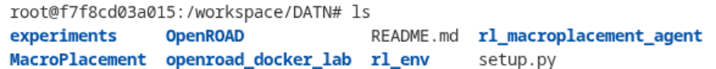


Lưu ý:

- luôn chạy các lệnh Python từ root repo `/home/khoahd/Documents/DATN-1`
- không chạy `train_ppo.py` hay `eval_policy.py` từ một thư mục con khác, vì các script này dựa vào layout tương đối của repo

## 2. Các biến cần tự thay

Trước khi chạy, hãy xác định 4 tên sau:

```text
<platform>       : ví dụ nangate45
<design_name>    : ví dụ practical_macro_soc_50
<flow_variant>   : ví dụ practical50_run_tight2
<generated_name> : ví dụ practical_macro_soc_50_tight2
```

Giả sử repo nằm tại:

```text
/home/khoahd/Documents/DATN-1
```

Thiết kế ORFS sẽ nằm tại:

```text
openroad_docker_lab/OpenROAD-flow-scripts/flow/designs/<platform>/<design_name>/
```

## 3. Chạy ORFS / OpenROAD

### 2.1. Vào container

Chạy trên host:

```bash
cd /home/khoahd/Documents/DATN-1
docker start openroad_cli
docker exec -it openroad_cli bash
```

Sau khi vào container:

```bash
cd /workspace/DATN/openroad_docker_lab/OpenROAD-flow-scripts/flow
pwd
```

Kết quả đúng phải là:

```text
/workspace/DATN/openroad_docker_lab/OpenROAD-flow-scripts/flow
```

### 2.2. Kiểm tra thư mục thiết kế

```bash
ls designs/<platform>/<design_name>
sed -n '1,120p' designs/<platform>/<design_name>/config.mk
```

Những file thường có:

- `config.mk`
- `constraint.sdc`
- `io.tcl`
- `macro_placement.tcl`
- RTL `.v`

### 2.3. Chạy synthesis

```bash
make -j1 \
  DESIGN_CONFIG=designs/<platform>/<design_name>/config.mk \
  FLOW_VARIANT=<flow_variant> \
  synth
```

Ý nghĩa:

- đọc RTL + liberty + SDC
- chạy tổng hợp logic
- sinh netlist gate-level
- sinh `1_synth.odb`

### 2.4. Chạy floorplan

```bash
make -j1 \
  DESIGN_CONFIG=designs/<platform>/<design_name>/config.mk \
  FLOW_VARIANT=<flow_variant> \
  do-floorplan
```

Ý nghĩa:

- đọc kết quả synthesis
- dựng die/core
- đặt IO pin theo `io.tcl`
- đặt macro theo `macro_placement.tcl`
- sinh floorplan database

### 2.5. Chạy placement

```bash
make -j1 \
  DESIGN_CONFIG=designs/<platform>/<design_name>/config.mk \
  FLOW_VARIANT=<flow_variant> \
  do-place
```
Ý nghĩa:

- đọc floorplan
- global placement
- detailed placement
- sinh `3_place.odb`

### 2.6. Kiểm tra log và output

```bash
ls results/<platform>/<design_name>/<flow_variant>
ls logs/<platform>/<design_name>/<flow_variant>
```

Xem nhanh floorplan:

```bash
grep -n "Design area\\|utilization\\|Core area\\|Restrict pins" \
  logs/<platform>/<design_name>/<flow_variant>/2_1_floorplan.log
```

### 2.7. Nếu cần sinh `3_place.def` từ `3_place.odb`

Một số bước export cần `3_place.def`. Nếu chưa có:

```bash
openroad -no_init <<'EOF'
read_db results/<platform>/<design_name>/<flow_variant>/3_place.odb
write_def results/<platform>/<design_name>/<flow_variant>/3_place.def
exit
EOF
```

Kiểm tra:

```bash
ls results/<platform>/<design_name>/<flow_variant>/3_place.def
```

Thoát container:

```bash
exit
```

## 4. Export sang thư mục cho MacroPlacement

Chạy trên host:

```bash
cd /home/khoahd/Documents/DATN-1
./openroad_docker_lab/scripts/export_flow_inputs.sh \
  <platform> <design_name> <flow_variant> <generated_name>
```

Ý nghĩa:

- lấy netlist / LEF / DEF / thư viện / SDC từ kết quả ORFS
- gom chúng vào một thư mục trung gian cho `flow.py`

Thư mục đầu ra sẽ nằm tại:

```text
MacroPlacement/Flows/NanGate45/generated/<design_name>/<generated_name>/
```

Nếu bạn vừa export trong container bằng user `root`, có thể sẽ bị lỗi quyền ở
thư mục `generated/`. Khi đó hãy đổi owner lại trước khi chạy `flow.py` trên
host:

```bash
sudo chown -R "$USER:$USER" \
  MacroPlacement/Flows/NanGate45/generated/<design_name>/<generated_name>
```

Hoặc nếu không dùng `sudo`, hãy sửa chủ sở hữu theo cách phù hợp trên máy của bạn.

## 5. Chạy `flow.py` để sinh đầu vào RL

Chạy trên host:

```bash
cd /home/khoahd/Documents/DATN-1
source rl_env/bin/activate
```

Không dùng path `/workspace/DATN/...` ở bước này nếu bạn đã `exit` khỏi
container. Trên host, hãy dùng path tương đối từ root repo hoặc path đầy đủ
`/home/khoahd/Documents/DATN-1/...`.

Chạy:

```bash
python MacroPlacement/Flows/util/flow.py \
  MacroPlacement/Flows/NanGate45/generated/<design_name>/<generated_name> \
  MacroPlacement/Flows/NanGate45/generated/<design_name>/<generated_name>/output_CodeElement
```

Ý nghĩa:

- đọc dữ liệu vật lý đã export
- phân tích connectivity
- xây dựng graph cho macro placement
- sinh đầu vào Circuit Training / RL

Kết quả quan trọng:

```text
MacroPlacement/Flows/NanGate45/generated/<design_name>/<generated_name>/<design_name>.pb.txt
MacroPlacement/Flows/NanGate45/generated/<design_name>/<generated_name>/<design_name>.plc
```

Kiểm tra:

```bash
sed -n '1,20p' \
  MacroPlacement/Flows/NanGate45/generated/<design_name>/<generated_name>/<design_name>.plc
```

Nếu gặp lỗi:

- `PermissionError: ... output_CodeElement`
  - thư mục `generated/.../<generated_name>/` đang thuộc owner `root`
  - sửa lại bằng `chown` rồi chạy lại
- `python3: can't open file '/workspace/DATN/.../openroad_partition_compat.py'`
  - file wrapper `openroad` trong thư mục `generated/...` đang chứa path kiểu
    container
  - hãy export lại bằng script `export_flow_inputs.sh` mới nhất rồi chạy lại

## 6. Train RL

```bash
cd /home/khoahd/Documents/DATN-1
source rl_env/bin/activate

python rl_macroplacement_agent/scripts/train_ppo.py \
  --netlist /home/khoahd/Documents/DATN-1/MacroPlacement/Flows/NanGate45/generated/<design_name>/<generated_name>/<design_name>.pb.txt \
  --init_plc /home/khoahd/Documents/DATN-1/MacroPlacement/Flows/NanGate45/generated/<design_name>/<generated_name>/<design_name>.plc \
  --out_dir /home/khoahd/Documents/DATN-1/experiments/<design_name>/<flow_variant>_ppo \
  --episodes 30 \
  --rollout_episodes 4 \
  --max_macros <max_macros> \
  --max_nodes <max_nodes> \
  --max_edges <max_edges> \
  --max_grid 32 \
  --wirelength_weight 1.0 \
  --density_weight 0.5 \
  --congestion_weight 0.5 \
  --batch_size 1 \
  --seed 1 \
  --device cpu
```

Bạn cần thay:

- `<max_macros>`
- `<max_nodes>`
- `<max_edges>`

Nếu chỉ test nhanh:

```bash
--episodes 5
```

## 7. Eval RL

```bash
python rl_macroplacement_agent/scripts/eval_policy.py \
  --model /home/khoahd/Documents/DATN-1/experiments/<design_name>/<flow_variant>_ppo/alphachip_like_actor_critic.pt \
  --netlist /home/khoahd/Documents/DATN-1/MacroPlacement/Flows/NanGate45/generated/<design_name>/<generated_name>/<design_name>.pb.txt \
  --init_plc /home/khoahd/Documents/DATN-1/MacroPlacement/Flows/NanGate45/generated/<design_name>/<generated_name>/<design_name>.plc \
  --out_dir /home/khoahd/Documents/DATN-1/experiments/<design_name>/<flow_variant>_eval \
  --max_macros <max_macros> \
  --max_nodes <max_nodes> \
  --max_edges <max_edges> \
  --max_grid 32 \
  --wirelength_weight 1.0 \
  --density_weight 0.5 \
  --congestion_weight 0.5 \
  --device cpu \
  --deterministic
```

Kết quả chính:

- `alphachip_like_eval_summary.json`
- `alphachip_like_final.plc`

## 8. Convert `plc` sang `tcl`

### 8.1. Convert initial placement

```bash
python MacroPlacement/Flows/util/plc_pb_to_placement_tcl.py \
  /home/khoahd/Documents/DATN-1/MacroPlacement/Flows/NanGate45/generated/<design_name>/<generated_name>/<design_name>.plc \
  /home/khoahd/Documents/DATN-1/MacroPlacement/Flows/NanGate45/generated/<design_name>/<generated_name>/<design_name>.pb.txt \
  /home/khoahd/Documents/DATN-1/experiments/<design_name>/<flow_variant>_eval/initial_from_plc.tcl
```

### 8.2. Convert RL final placement

```bash
python MacroPlacement/Flows/util/plc_pb_to_placement_tcl.py \
  /home/khoahd/Documents/DATN-1/experiments/<design_name>/<flow_variant>_eval/alphachip_like_final.plc \
  /home/khoahd/Documents/DATN-1/MacroPlacement/Flows/NanGate45/generated/<design_name>/<generated_name>/<design_name>.pb.txt \
  /home/khoahd/Documents/DATN-1/experiments/<design_name>/<flow_variant>_eval/final_from_plc.tcl
```

Kiểm tra:

```bash
sed -n '1,10p' \
  /home/khoahd/Documents/DATN-1/experiments/<design_name>/<flow_variant>_eval/final_from_plc.tcl
```

### 8.3. Nếu `source` trên OpenROAD báo macro nằm ngoài core

Một số placement RL có thể hợp lệ theo canvas của `.plc`, nhưng khi convert sang Tcl rồi
source lên OpenROAD thì một vài macro bị lệch ra ngoài core vài micron. Khi đó, hãy clamp
lại Tcl theo đúng core box của DEF:

```bash
python rl_macroplacement_agent/scripts/clamp_place_tcl_to_def_core.py \
  --in_tcl /home/khoahd/Documents/DATN-1/experiments/<design_name>/<flow_variant>_eval/final_from_plc.tcl \
  --pb /home/khoahd/Documents/DATN-1/MacroPlacement/Flows/NanGate45/generated/<design_name>/<generated_name>/<design_name>.pb.txt \
  --def_file /home/khoahd/Documents/DATN-1/openroad_docker_lab/OpenROAD-flow-scripts/flow/results/<platform>/<design_name>/<flow_variant>/3_place.def \
  --out_tcl /home/khoahd/Documents/DATN-1/experiments/<design_name>/<flow_variant>_eval/final_from_plc_clamped.tcl
```

Nếu muốn clamp cả initial:

```bash
python rl_macroplacement_agent/scripts/clamp_place_tcl_to_def_core.py \
  --in_tcl /home/khoahd/Documents/DATN-1/experiments/<design_name>/<flow_variant>_eval/initial_from_plc.tcl \
  --pb /home/khoahd/Documents/DATN-1/MacroPlacement/Flows/NanGate45/generated/<design_name>/<generated_name>/<design_name>.pb.txt \
  --def_file /home/khoahd/Documents/DATN-1/openroad_docker_lab/OpenROAD-flow-scripts/flow/results/<platform>/<design_name>/<flow_variant>/3_place.def \
  --out_tcl /home/khoahd/Documents/DATN-1/experiments/<design_name>/<flow_variant>_eval/initial_from_plc_clamped.tcl
```

## 9. Xem trên OpenROAD GUI

### 9.1. Mở GUI đúng cách

Không dùng `openroad_cli` để mở GUI trực tiếp. Hãy mở GUI bằng script chuyên dụng của repo:

```bash
cd /home/khoahd/Documents/DATN-1
xhost +local:docker
./openroad_docker_lab/scripts/run_gui.sh
```

Sau khi shell trong container GUI mở ra:

```bash
cd /workspace/DATN/openroad_docker_lab/OpenROAD-flow-scripts/flow
openroad -gui
```

### 9.2. Xem initial placement

```tcl
read_db ./results/<platform>/<design_name>/<flow_variant>/2_1_floorplan.odb
source /workspace/DATN/experiments/<design_name>/<flow_variant>_eval/initial_from_plc.tcl
gui::fit
```

Nếu initial Tcl đã được clamp thì source file đã clamp:

```tcl
read_db ./results/<platform>/<design_name>/<flow_variant>/2_1_floorplan.odb
source /workspace/DATN/experiments/<design_name>/<flow_variant>_eval/initial_from_plc_clamped.tcl
gui::fit
```

### 9.3. Xem RL final placement

```tcl
read_db ./results/<platform>/<design_name>/<flow_variant>/2_1_floorplan.odb
source /workspace/DATN/experiments/<design_name>/<flow_variant>_eval/final_from_plc.tcl
gui::fit
```

Nếu RL final Tcl đã được clamp:

```tcl
read_db ./results/<platform>/<design_name>/<flow_variant>/2_1_floorplan.odb
source /workspace/DATN/experiments/<design_name>/<flow_variant>_eval/final_from_plc_clamped.tcl
gui::fit
```

### 9.4. Có thể dùng `3_place.odb` thay cho `2_1_floorplan.odb`

Nếu bạn muốn xem macro placement trên database placement đầy đủ hơn:

```tcl
read_db ./results/<platform>/<design_name>/<flow_variant>/3_place.odb
source /workspace/DATN/experiments/<design_name>/<flow_variant>_eval/final_from_plc_clamped.tcl
gui::fit
```

Lưu ý rất quan trọng:

- file `.tcl` phải được source lên đúng `floorplan.odb` cùng hệ tọa độ
- nếu bạn đổi `DIE_AREA` hoặc `CORE_AREA`, thì phải export lại, chạy `flow.py` lại, train/eval lại
- không được lấy `final_from_plc.tcl` của layout cũ source lên `odb` của layout mới
- nếu OpenROAD báo `Cannot place ... outside of the core`, hãy clamp Tcl theo `3_place.def`

## 10. Khi chỉ sửa `DIE_AREA` / `CORE_AREA`

Nếu bạn chỉ sửa:

- `DIE_AREA`
- `CORE_AREA`
- `PLACE_DENSITY`
- `io.tcl`
- `macro_placement.tcl`

thì không cần synthesis lại từ RTL.

Quy trình ngắn:

```text
sửa config / io / macro placement
-> chạy lại floorplan
-> chạy lại place
-> export_flow_inputs.sh
-> flow.py
-> pb.txt + plc mới
-> train RL mới
-> eval mới
```

Nếu muốn sạch hoàn toàn, bạn vẫn có thể chạy lại từ synthesis, nhưng không bắt buộc.

## 11. Các lỗi thường gặp

### 10.1. `openroad: command not found`

Bạn đang chạy lệnh cần OpenROAD trên host thay vì trong container.

### 10.2. `Permission denied` ở `generated/`

Một thư mục được tạo trước đó bởi `root`, cần sửa quyền.

### 11.3. `ModuleNotFoundError` với `sortedcontainers`, `matplotlib`, `torch`, ...

Môi trường Python chưa được cài đúng từ file requirement. Chạy lại:

```bash
cd /home/khoahd/Documents/DATN-1
source rl_env/bin/activate
python -m pip install --upgrade pip setuptools wheel
python -m pip install -r rl_macroplacement_agent/requirements.txt
```

### 11.4. `Cannot place ... outside of the core`

Nguyên nhân thường gặp:

- source `tcl` cũ lên `odb` mới
- `plc` được sinh từ canvas cũ nhưng đang áp vào floorplan mới
- đã đổi core/die nhưng chưa regenerate đầu vào RL

Cách xử lý an toàn nhất:

```bash
python rl_macroplacement_agent/scripts/clamp_place_tcl_to_def_core.py \
  --in_tcl /path/to/final_from_plc.tcl \
  --pb /path/to/<design>.pb.txt \
  --def_file /path/to/3_place.def \
  --out_tcl /path/to/final_from_plc_clamped.tcl
```

Sau đó source file `_clamped.tcl` trên OpenROAD.

### 11.5. `qt.qpa.xcb: could not connect to display`

Bạn đang mở GUI sai cách, thường là chạy `openroad -gui` trong container CLI không có X11 forwarding.

Hãy dùng:

```bash
cd /home/khoahd/Documents/DATN-1
xhost +local:docker
./openroad_docker_lab/scripts/run_gui.sh
```

### 11.6. `congestion_cost` bị lỗi metadata route bằng 0

Phải dùng `plc` đã được normalize metadata đúng với NanGate45 trước khi train/eval.

## 12. Ví dụ đầy đủ với `practical_macro_soc_50`

Ví dụ dưới đây dùng `run_1` để dễ thay lại cho các testcase khác. Bạn chỉ cần
đổi `FLOW_VARIANT=run_1` sang tên lần chạy khác nếu muốn.

Artifact da chay san cho vi du nay duoc luu tai:

```text
artifacts/practical_macro_soc_50/run_1/
```

Thu muc nay gom:

- `train/`: model va train summary
- `eval/`: final `.plc`, eval summary, `final_from_plc.tcl`, `final_from_plc_clamped.tcl`
- `macroplacement_input/`: `practical_macro_soc_50.pb.txt` va `practical_macro_soc_50.plc`
- `openroad/`: `3_place.def` va `rl_placed.def`

### 11.1. ORFS

```bash
cd /home/khoahd/Documents/DATN-1
source rl_env/bin/activate
docker start openroad_cli
docker exec -it openroad_cli bash
cd /workspace/DATN/openroad_docker_lab/OpenROAD-flow-scripts/flow
```
Synthesis:
```bash
make -j1 \
  DESIGN_CONFIG=designs/nangate45/practical_macro_soc_50/config.mk \
  FLOW_VARIANT=run_1 \
  synth
```
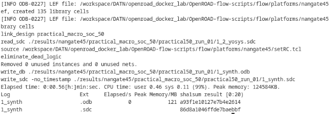

Floorplanning:
```bash
make -j1 \
  DESIGN_CONFIG=designs/nangate45/practical_macro_soc_50/config.mk \
  FLOW_VARIANT=run_1 \
  do-floorplan
```
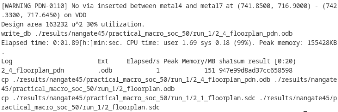

Placement:
```bash
make -j1 \
  DESIGN_CONFIG=designs/nangate45/practical_macro_soc_50/config.mk \
  FLOW_VARIANT=run_1 \
  do-place
```
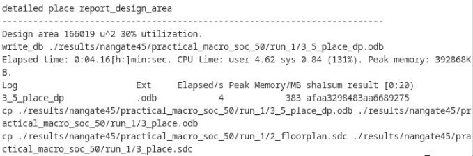

### 11.2. DEF nếu thiếu

```bash
openroad -no_init <<'EOF'
read_db results/nangate45/practical_macro_soc_50/run_1/3_place.odb
write_def results/nangate45/practical_macro_soc_50/run_1/3_place.def
exit
EOF

exit
```
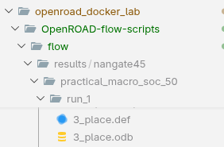

### 11.3. Export cho MacroPlacement

```bash
cd /home/khoahd/Documents/DATN-1
./openroad_docker_lab/scripts/export_flow_inputs.sh \
  nangate45 practical_macro_soc_50 run_1 practical_macro_soc_50_run_1
```

Nếu vừa export trong container:

```bash
sudo chown -R khoahd:khoahd \
  /home/khoahd/Documents/DATN-1/MacroPlacement/Flows/NanGate45/generated/practical_macro_soc_50/practical_macro_soc_50_run_1
```

### 11.4. Chạy `flow.py`

```bash
cd /home/khoahd/Documents/DATN-1
source rl_env/bin/activate

python MacroPlacement/Flows/util/flow.py \
  MacroPlacement/Flows/NanGate45/generated/practical_macro_soc_50/practical_macro_soc_50_run_1 \
  MacroPlacement/Flows/NanGate45/generated/practical_macro_soc_50/practical_macro_soc_50_run_1/output_CodeElement
```
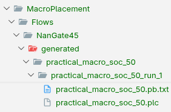

Lệnh này chạy trên host, không chạy với path `/workspace/DATN/...`.

### 11.5. Train RL

```bash
python rl_macroplacement_agent/scripts/train_ppo.py \
  --netlist /home/khoahd/Documents/DATN-1/MacroPlacement/Flows/NanGate45/generated/practical_macro_soc_50/practical_macro_soc_50_run_1/practical_macro_soc_50.pb.txt \
  --init_plc /home/khoahd/Documents/DATN-1/MacroPlacement/Flows/NanGate45/generated/practical_macro_soc_50/practical_macro_soc_50_run_1/practical_macro_soc_50.plc \
  --out_dir /home/khoahd/Documents/DATN-1/experiments/practical_macro_soc_50/run_1_ppo \
  --episodes 30 \
  --rollout_episodes 4 \
  --max_macros 50 \
  --max_nodes 4096 \
  --max_edges 12000 \
  --max_grid 32 \
  --wirelength_weight 1.0 \
  --density_weight 0.5 \
  --congestion_weight 0.5 \
  --batch_size 1 \
  --seed 1 \
  --device cpu
```
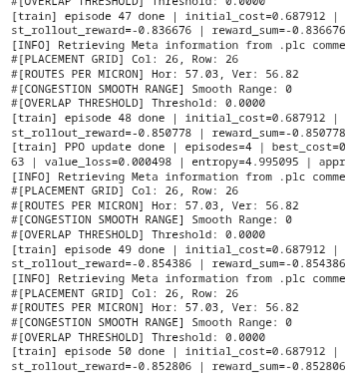

Kết quả log:

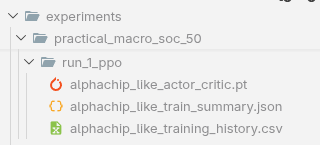
### 11.6. Eval RL

```bash
python rl_macroplacement_agent/scripts/eval_policy.py \
  --model /home/khoahd/Documents/DATN-1/experiments/practical_macro_soc_50/run_1_ppo/alphachip_like_actor_critic.pt \
  --netlist /home/khoahd/Documents/DATN-1/MacroPlacement/Flows/NanGate45/generated/practical_macro_soc_50/practical_macro_soc_50_run_1/practical_macro_soc_50.pb.txt \
  --init_plc /home/khoahd/Documents/DATN-1/MacroPlacement/Flows/NanGate45/generated/practical_macro_soc_50/practical_macro_soc_50_run_1/practical_macro_soc_50.plc \
  --out_dir /home/khoahd/Documents/DATN-1/experiments/practical_macro_soc_50/run_1_eval \
  --max_macros 50 \
  --max_nodes 4096 \
  --max_edges 12000 \
  --max_grid 32 \
  --wirelength_weight 1.0 \
  --density_weight 0.5 \
  --congestion_weight 0.5 \
  --device cpu \
  --deterministic
```
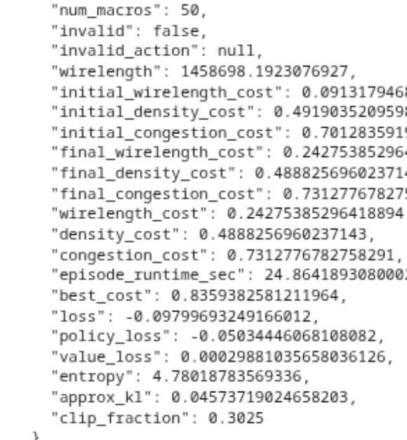

Kết quả plc:

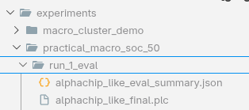
### 11.7. Convert sang TCL

```bash
python MacroPlacement/Flows/util/plc_pb_to_placement_tcl.py \
  /home/khoahd/Documents/DATN-1/experiments/practical_macro_soc_50/run_1_eval/alphachip_like_final.plc \
  /home/khoahd/Documents/DATN-1/MacroPlacement/Flows/NanGate45/generated/practical_macro_soc_50/practical_macro_soc_50_run_1/practical_macro_soc_50.pb.txt \
  /home/khoahd/Documents/DATN-1/experiments/practical_macro_soc_50/run_1_eval/final_from_plc.tcl
```

Nếu macro bị lệch ra ngoài core khi source lên GUI:

```bash
python rl_macroplacement_agent/scripts/clamp_place_tcl_to_def_core.py \
  --in_tcl /home/khoahd/Documents/DATN-1/experiments/practical_macro_soc_50/run_1_eval/final_from_plc.tcl \
  --pb /home/khoahd/Documents/DATN-1/MacroPlacement/Flows/NanGate45/generated/practical_macro_soc_50/practical_macro_soc_50_run_1/practical_macro_soc_50.pb.txt \
  --def_file /home/khoahd/Documents/DATN-1/openroad_docker_lab/OpenROAD-flow-scripts/flow/results/nangate45/practical_macro_soc_50/run_1/3_place.def \
  --out_tcl /home/khoahd/Documents/DATN-1/experiments/practical_macro_soc_50/run_1_eval/final_from_plc_clamped.tcl
```

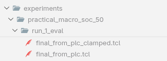
### 11.8. Xem trên GUI

```bash
cd /home/khoahd/Documents/DATN-1
xhost +local:docker
./openroad_docker_lab/scripts/run_gui.sh
```

Trong shell của container GUI:

```bash
cd /workspace/DATN/openroad_docker_lab/OpenROAD-flow-scripts/flow
openroad -gui
```

Trong OpenROAD:

```tcl
read_db ./results/nangate45/practical_macro_soc_50/run_1/2_1_floorplan.odb
source /workspace/DATN/experiments/practical_macro_soc_50/run_1_eval/final_from_plc_clamped.tcl
gui::fit
```

```tcl
read_db ./results/nangate45/practical_macro_soc_50/run_1/2_1_floorplan.odb
source /workspace/DATN/experiments/practical_macro_soc_50/run_1_eval/final_from_plc_clamped.tcl
gui::fit
```

Kết quả RL Placement trên Openroad: 

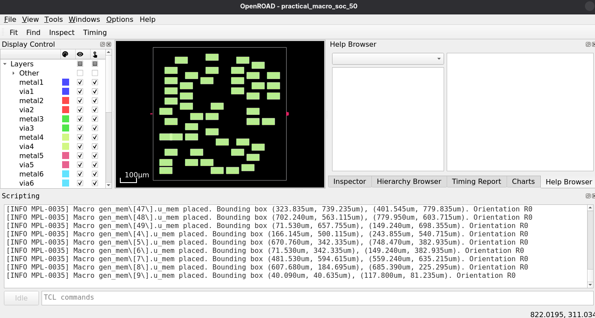

Lệnh tạo vị trí vật lý cho các bước tiếp theo hoàn thiện chu trình thiết kế vật lý EDA(CTS,Routing,etc..):

Sau khi source thiết kế .tcl
```tcl
write_db /workspace/DATN/openroad_docker_lab/OpenROAD-flow-scripts/flow/results/nangate45/practical_macro_soc_50/run_1/rl_placed.odb
```
hoặc:
```tcl
write_def /workspace/DATN/openroad_docker_lab/OpenROAD-flow-scripts/flow/results/nangate45/practical_macro_soc_50/run_1/rl_placed.def
```
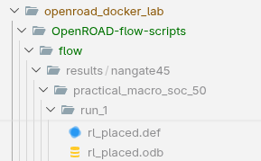
